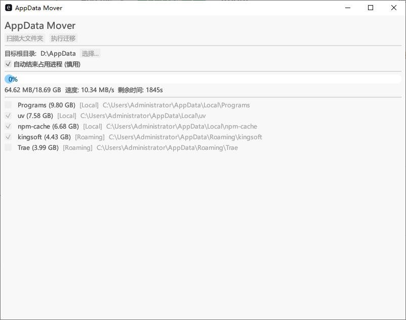

# WindowsClear (AppData Mover)

[中文](README.md) | [English](README_EN.md)



## 简介
Windows 系统盘清理利器，专注于释放 `AppData` 目录占用的巨量空间。它能扫描出占用空间大的软件数据文件夹，一键迁移到其他磁盘（如 D 盘），并自动创建目录联接，确保软件无缝运行，就像从未移动过一样。

## 核心功能
*   **智能扫描**: 自动分析 `%LOCALAPPDATA%` 和 `%APPDATA%`，快速定位占用超过 10% 空间的“大户”。
*   **无缝迁移**: 跨盘移动文件后，自动在原位创建 Junction 链接，软件无需重新配置。
*   **安全可靠**:
    *   **占用清理**: 自动检测文件占用，支持自动结束相关进程（使用 Windows Restart Manager 技术），非底层实现，有些不一定可以清理，但基本不影响空间释放效果。
    *   **失败回滚**: 迁移过程中若发生错误，自动尝试恢复，保障数据安全。
*   **人性化体验**:
    *   **极速性能**: 基于 Rust 开发，多线程并行扫描，速度飞快。
    *   **智能缓存**: 二次扫描无变动时秒出结果。
    *   **可视化进度**: 精确到字节的进度条，实时显示传输速度和剩余时间预估。
    *   **中英双语**: 界面支持中英文一键切换。
    *   **暂停/继续**: 大文件传输过程中可随时暂停。

## 使用方法
1.  **以管理员身份运行** `WindowsClear.exe` 。
2.  点击 **“扫描大文件夹”**。
3.  在列表中勾选你想要迁移的软件（建议先从不重要的软件开始尝试）。
4.  选择 **目标根目录**（例如 `D:\AppData`）。
5.  点击 **“执行迁移”**，等待完成即可。

## 常见问题
*   **为什么要管理员权限？**
    *   创建目录联接（mklink /J）和查询/结束其他进程通常需要管理员权限。
*   **迁移后软件还能打开吗？**
    *   是的。Windows 的目录联接对应用程序是透明的，软件会认为文件仍然在 C 盘。
*   **如何恢复？**
    *   只需删除 C 盘的快捷方式（带箭头图标的文件夹），然后把 D 盘的文件剪切回 C 盘原位即可。

## 构建指南
本项目使用 Rust 开发。

```bash
# 克隆仓库
git clone https://github.com/tanaer/WindowsClear.git
cd WindowsClear

# 编译 Release 版本
cargo build --release
```
## 打赏
### 爱发电
https://afdian.com/a/anyone168

### USDT-TRC20
`TREQQPsEVBMH6SqboRoVYh5Hk7fMSCGkAx`

## License
MIT License
